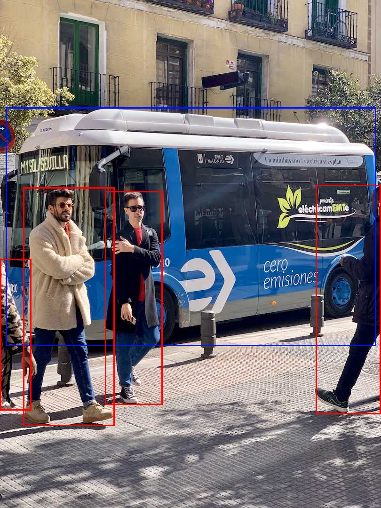
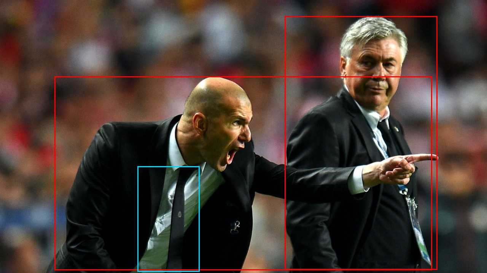

# yolov11_cpp

Training **YOLO11** in C++ with **zero external dependencies** — a from-scratch autograd
engine, C++ standard library only (plus two vendored single-header image libs for the
demo). Every step is **verified numerically against Ultralytics YOLO11** (PyTorch).

日本語: 本物の YOLO11 を C++ で。自作 autograd エンジン（標準ライブラリのみ）で yolo11n の
順伝播・損失・学習・推論を再現し、各段階を本家 Ultralytics と数値比較。CPU / OpenMP は
`-fopenmp` の有無だけ。姉妹プロジェクト: **yolov8_cpp**, **yolov5_cpp**。

The autograd engine (im2col+GEMM conv incl. **grouped/depthwise**, BN, SiLU, matmul,
softmax, …), optimizers, dataloader and COCO-mAP are shared with yolov8_cpp. What is new
here is YOLO11's architecture: **C3k2** blocks (Bottleneck or nested **C3k**), **C2PSA**
(multi-head self-attention: qkv / scaled dot-product softmax / positional depthwise conv
/ proj + FFN), and a **DFL detect head with depthwise convs**. The head is anchor-free
DFL, so the **loss (DFL + TAL + CIoU + BCE) and decode are reused from yolov8** verbatim.

## Status
| file | milestone | result |
|------|-----------|--------|
| `pure/net11.hpp` + `pure/m1_forward.cpp` | **full yolo11n forward** (C3k2, C2PSA attention, DFL head) | matches yolo11n ~3e-5 |
| `pure/mg_gconv.cpp` | grouped/depthwise conv (fwd+bwd) | matches torch ~1e-5 |
| `pure/m2_train.cpp` | **end-to-end training** (forward → v8 loss + TAL → backward → Adam/cosine) | loss 12.9 → 1.7 |
| `pure/infer.hpp` + `pure/m3_infer.cpp` | **inference: DFL decode + NMS** (reused from yolov8) | dets match yolo11n ~8e-5 |
| `pure/m4_demo.cpp` | **real-image inference** (stb → letterbox → detect → annotate) | bus + 4 people |
| `pure/metrics.hpp` + `pure/m5_map.cpp` | **COCO mAP** (AP@0.50, AP@0.50:0.95) | match pycocotools ~3e-7 |
| `pure/net11_unfused.hpp` + `pure/m6_unfused.cpp` | unfused conv+BN+SiLU forward | matches yolo11n ~2e-5 |
| `pure/m7_train_writeback.cpp` | **train (live BN) → write weights back to `.pt`** | serialization exact; yolo11 reloads it |
| `pure/onnx_export11.cpp` | **ONNX writer** (incl. attention as Slice/Reshape/Transpose/MatMul/Softmax) | onnxruntime runs it, ~2e-5 |
| `pure/onnx_run.hpp` + `pure/m8_onnx_run.cpp` | **ONNX reader + graph interpreter** | pure engine runs the `.onnx`, ~3e-5 |

## Train with zero Python — the full loop in C++

`pure/train_cli.cpp` is a real training environment, pure C++, **no Python at run time**:
dataset scan → shuffled mini-batches (hflip + brightness augmentation) over epochs →
TaskAlignedAssigner → v8 loss → Adam (warmup + cosine LR + weight decay) → **per-epoch
validation mAP@0.5** → save `best.pt` / `last.pt` via the pure-C++ `.pt` writer.

```sh
cl /std:c++20 /O2 /EHsc /Ipure\third_party pure\make_init_pt.cpp   # or g++ ...
cl /std:c++20 /O2 /EHsc /Ipure\third_party pure\train_cli.cpp

./make_init_pt init.pt from yolo11n.pt      # C++ builds the initial-weights .pt (see below)
./train_cli pure/ref/data_synth/list.txt pure/ref/data_synth/val.txt 6 4 init.pt
#   val mAP@0.5 rises 0.25 -> ~1.0 over 6 epochs on the synthetic set -> best.pt / last.pt
```

The C++-trained `best.pt` loads straight back into Ultralytics
(`model.load_state_dict(torch.load('best.pt'))`, 0 unexpected keys) and detects the right
classes — train/retrain in C++, then drop the result into any PyTorch pipeline. (Checkpoint
keys are paired by **name** via `names.txt`, since the C3k2 emit order differs from
PyTorch's `state_dict` order.)

### Make the initial-weights `.pt` in C++ — no Python needed to bootstrap

`pure/make_init_pt.cpp` writes a valid `state_dict` `.pt` entirely in C++, driven only by
two tiny text files that ship in the repo — `pure/ref/data_net/manifest_unfused.txt`
(per-layer shapes) and `names.txt` (state_dict keys). No Python, no libtorch:

- **`rand`** — He/Kaiming random init, fully self-contained (needs neither a pretrained
  file nor Python). Loads in Ultralytics (0 unexpected). Trains mechanically, but
  from-scratch convergence needs real data volume + many epochs.
- **`from <pretrained.pt>`** — copies pretrained values read in C++ by `ptio`
  (`load_pt` for a state_dict, `load_pt_module` for a raw Ultralytics checkpoint). This is
  the practical **transfer-learning** init; the only input is the `.pt` file (just download
  it — no Python).

**All sizes.** The generator is size-agnostic — it just reads the arch files. Every size's
`manifest_unfused.txt` + `names.txt` ship under `pure/ref/arch/<model>/` (n/s/m/l/x), so
`./make_init_pt out.pt rand yolo11n.pt pure/ref/arch/yolo11m/` builds an init `.pt` for any
size with zero Python. Each verified to load into its architecture (0 unexpected keys):
n/s 417, m 542, l/x 847 tensors. Regenerate them with `python pure/ref/export_arch_all.py`
(built from `.yaml`, no download).

`train_cli` starts from that init `.pt` (`load_net_unfused_pt` in `pure/net11_unfused.hpp`,
arch from the manifest, tensors looked up by `names.txt` key) when present, else from the
`.bin` export. So a fresh clone bootstraps and trains with **zero Python**: `make_init_pt`
→ `init.pt` → `train_cli`. (Regenerate the synthetic set with `python pure/ref/make_synth.py
96 24` — the one Python touch, only to fabricate demo images.)

## Demo — real-image detection, no Python, no libraries
Weights ship in `weights/yolo11n/`, so the pure detector runs from a checkout with only a
C++ compiler + the two vendored single-header libs:
```sh
g++ -std=c++20 -O2 -Ipure/third_party pure/m4_demo.cpp -o m4_demo
./m4_demo assets/bus.jpg bus_out.png 640
```
| `assets/bus.jpg` → | `assets/zidane.jpg` → |
|---|---|
|  |  |

These match yolo11n's own output (boxes ~8e-5 on the letterboxed input).

## Build
```sh
python pure/ref/export_yolo11.py 64        # yolo11n fused weights + reference forward
g++ -std=c++20 -O2 pure/m1_forward.cpp -o m1     # or: cl /std:c++20 /O2 /EHsc pure/m1_forward.cpp
./m1
```

## Licenses & attribution
Own code is **BSD 3-Clause** ([LICENSE](LICENSE)). Bundled Ultralytics YOLO11 weights are
**AGPL-3.0**, stb is **public-domain / MIT** — see [THIRD_PARTY_NOTICES.md](THIRD_PARTY_NOTICES.md).
